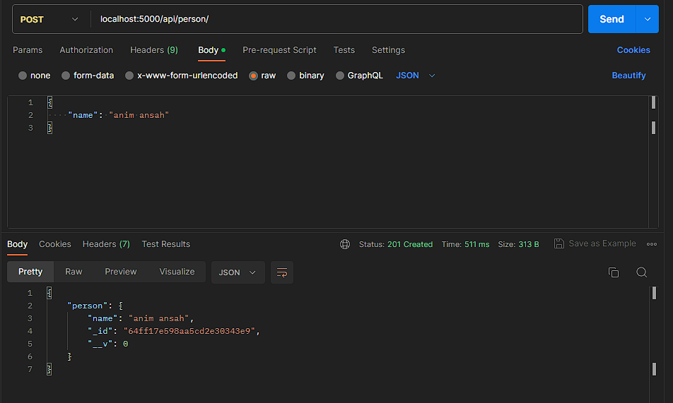
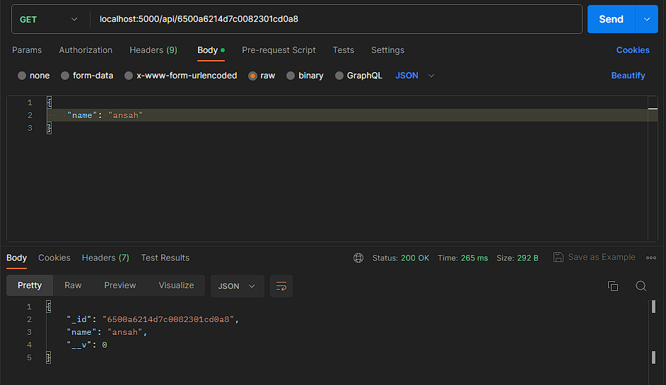
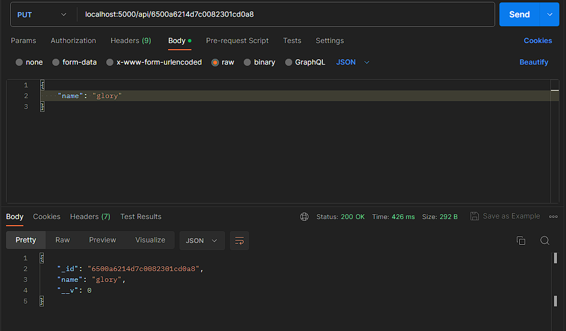
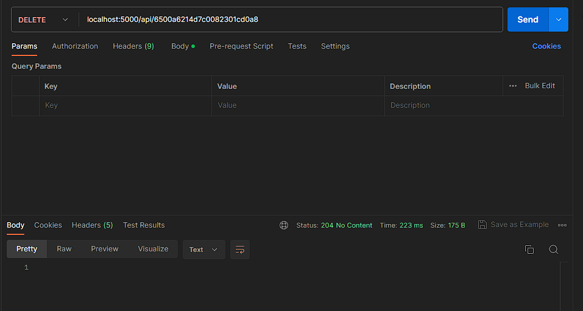

# Simple REST API capable of CRUD operations on a "person" resource
The entire application is within ``index.js`` file.  
This project uses Node, Express Js and MongoDB  

## Requirements
[NodeJS](https://nodejs.com)  
[ExpressJs](https://expressjs.com)  
[MongoDB](https://mongodb.com)  
API testing software eg. ``Postman`` or ``Insomnia`` or ``Thunder Bolt``

## Install
```shell
    $ git clone https://github.com/AnimBadger/Zuri
    $ cd ProjectTwo
    $ npm install
```
## Run
```shell  
    $ npm start
```
## Endpoints
``POST`` <localhost:5000/api/person/>  
``GET`` <localhost:5000/api/person/:id>   
``PUT`` <localhost:5000/api/person/:id>  
``DELETE`` <localhost:5000/api/person/:id>  

``person`` model takes ``name`` only from body.  
## Example
``Create person``  
  

``Get Person``
  

``Update Person``
  

``Delete Person``
  

## UML Diagram  
``Class Diagram can be found ``[Here](https://share.ue.internxt.com/sh/file/60c3b038f0e50a0eab38/69053cc3fc010c77e802d172813a809cecd3b83729ef0ff0eb212a541a5c9f43)